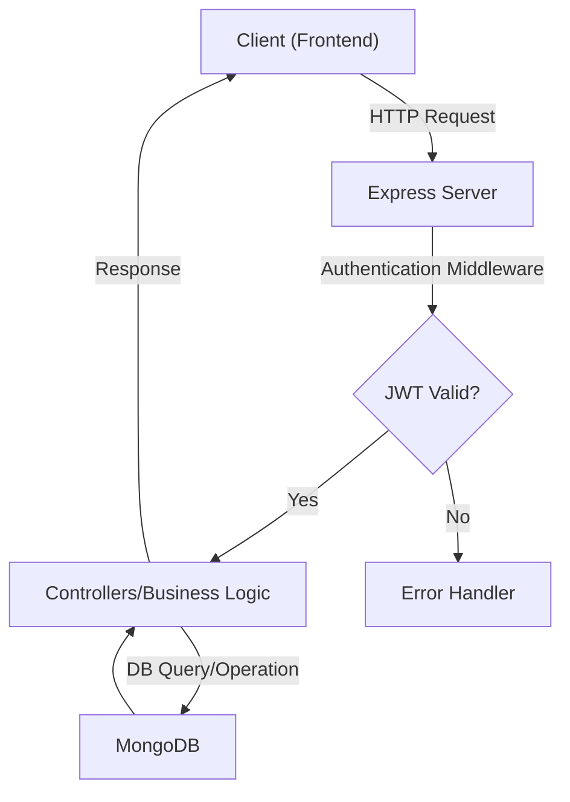
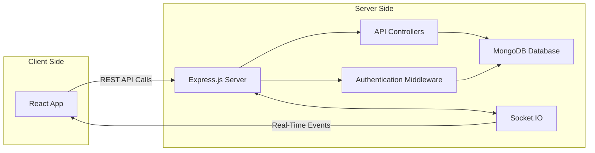

# FLowTalk-2.0 🚀

[](https://flowtalkv2.vercel.app)
[](#license)
[](https://reactjs.org)
[](https://nodejs.org)
[](https://www.mongodb.com/)
[](https://socket.io/)

FLowTalk-2.0 is a powerful and modern conversational platform built for seamless, real-time communications. The design leverages a rich JavaScript ecosystem, best-in-class libraries, and robust backend architecture.

---

## 🔍 Table of Contents

- [📁 File Structure](#-file-structure)
- [🛠 Tech Stack & Frameworks](#-tech-stack--frameworks)
- [✨ Features](#-features)
- [🔁 API Flow Chart](#-api-flow-chart)
- [🏗 System Architecture Diagram](#-system-architecture-diagram)
- [🚀 Deployment](#-deployment)
- [🐑 Cloning & Forking](#-cloning--forking)
- [🤝 Contribution](#-contribution)
- [💡 Acknowledgement](#-acknowledgement)
- [📜 License](#-license)

---

## 📁 File Structure

> Here's the actual project structure, visualized for clarity:

```
FLOWTALK 2.0/
├── Backend/
│   ├── node_modules/
│   ├── src/
│   │   ├── config/
│   │   │   ├── db.js
│   │   │   ├── env.js
│   │   │   ├── ingest.js
│   │   │   └── stream.js
│   │   ├── controllers/
│   │   │   └── chat.controller.js
│   │   ├── middleware/
│   │   │   └── auth.middleware.js
│   │   ├── models/
│   │   │   └── user.model.js
│   │   ├── routes/
│   │   └── server.js
│   ├── .env
│   ├── instrument.js
│   ├── package-lock.json
│   ├── package.json
│   └── vercel.json
├── Frontend/
│   ├── node_modules/
│   ├── public/
│   │   ├── auth.png
│   │   └── logo.png
│   ├── src/
│   │   ├── components/
│   │   │   ├── CreateChannelModal.jsx
│   │   │   ├── CustomChannelHeader.jsx
│   │   │   ├── CustomChannelPreview.jsx
│   │   │   ├── InviteModal.jsx
│   │   │   ├── MembersModal.jsx
│   │   │   ├── PageLoader.jsx
│   │   │   ├── PinnedMessagesModal.jsx
│   │   │   └── UsersList.jsx
│   │   ├── hooks/
│   │   ├── lib/
│   │   │   └── apis/
│   │   │       └── axios.js
│   │   ├── pages/
│   │   │   ├── AuthPage.jsx
│   │   │   ├── CallPage.jsx
│   │   │   └── HomePage.jsx
│   │   ├── providers/
│   │   └── styles/
│   │       ├── App.css
│   │       ├── App.jsx
│   │       └── index.css
│   ├── .env
│   ├── gitignore
│   ├── eslintrc.json
│   ├── index.html
│   ├── package-lock.json
│   ├── package.json
│   └── README.md
```

---

## 🛠 Tech Stack & Frameworks

### 🖥️ **Frontend**
- **React**  – core SPA framework
- **React Router DOM** – navigation and routing
- **Redux** (optional) – global state management
- **Axios** – HTTP requests
- **Socket.IO-client** – real-time communication
- **CSS Modules/SASS/Styled-components** – component-level styling

### 💻 **Backend**
- **Node.js**  – JavaScript server runtime
- **Express.js** – routing & middleware
- **Socket.IO** – bidirectional real-time communication
- **Mongoose** – elegant MongoDB object modeling
- **jsonwebtoken** – authentication (JWT)
- **bcryptjs** – secure password hashing
- **dotenv** – environment configuration
- **Morgan/winston** (optional) – logging

### 🗄️ **Database**
- **MongoDB** 

### ⚒️ **Dev Tooling**
- **eslint/prettier** – code linting and formatting
- **nodemon** – backend auto-reloading
- **Postman** – API testing

---

## ✨ Features

- 🔒 **Authentication:** Secure registration & login using JWT.
- 🗨️ **Real-time Chat:** Instant messaging via Socket.IO.
- 🧑‍🤝‍🧑 **Channel Management:** Create/manage channels, invitations, and memberships.
- 📌 **Pinned Messages:** Highlight important discussions.
- 📞 **Call Support:** Direct calls on supported channels.
- 👥 **User Lists & Member Modal Management.**
- 🌐 **Responsive UI:** Mobile & desktop friendly interface.
- 📝 **Modern UX:** Clean, fast, and interactive experience.
- ⚡ **Fully Deployed & Cloud-Hosted!**

**🌟 [Live Project](https://f-low-talk-2-0-front-end.vercel.app/) 🟢 – Try it now!**

---

## 🔁 API Flow Chart



---

## 🏗 System Architecture Diagram



---

## 🚀 Deployment

The live project is hosted on [Vercel](https://vercel.com).  
**🔗 [Try FLowTalk-2.0 Live!](https://f-low-talk-2-0-front-end.vercel.app/)**

**Deploy your own instance:**

1. Fork & clone the repository.  
   ```bash
   git clone https://github.com/Priyanshu2229140/FLowTalk-2.0.git
   cd FLowTalk-2.0
   ```
2. Inside `/Backend` and `/Frontend`, install dependencies:  
   ```bash
   cd Backend && npm install
   cd ../Frontend && npm install
   ```
3. Configure your own `.env` files for both backend and frontend environments.
4. Start backend server:  
   ```bash
   cd Backend && npm run dev
   ```
5. Start frontend app:  
   ```bash
   cd Frontend && npm start
   ```
6. For one-click deployment, use Vercel’s [Import Project](https://vercel.com/new) feature.

---

## 🐑 Cloning & Forking

- **Clone this project**  
  ```bash
  git clone https://github.com/Priyanshu2229140/FLowTalk-2.0.git
  ```
- **Fork to your account:**  
  Click the ⭐️ 'Fork' button at the top of [this repo](https://github.com/Priyanshu2229140/FLowTalk-2.0)

---

## 🤝 Contribution

1. **Fork the repo**
2. **Clone your fork**  
   `git clone https://github.com/<your-username>/FLowTalk-2.0.git`
3. **Create your branch**  
   `git checkout -b feature/YourFeature`
4. **Commit & Push your changes**  
   `git add .`  
   `git commit -m "Add your feature"`  
   `git push origin feature/YourFeature`
5. **Open a Pull Request**  
   Go to your fork’s repo on GitHub ➔ "Pull requests" ➔ "New pull request" ➔ Select your branch ➔ Submit.

---

## 💡 Acknowledgement

- 🦄 [Priyanshu2229140](https://github.com/Priyanshu2229140) – project owner
- 🙏 All contributors, testers, and tool/library authors whose work makes this project possible

---

## 📜 License

Distributed under the [MIT License](LICENSE).

---

> **Note:**  
> Update your `.env` file and relevant configurations before running the app locally.  
> For issues or ideas, open an [issue](https://github.com/Priyanshu2229140/FLowTalk-2.0/issues).

```
# Example Backend .env
MONGO_URI=your_mongodb_connection_string
JWT_SECRET=your_jwt_secret
PORT=5000

# Example Frontend .env
REACT_APP_API_URL=http://localhost:5000
```

---
